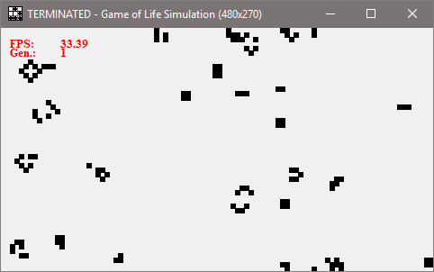

# Conways Game of Life

Python 3.x reference implementation for [Conways Game of Life](https://en.wikipedia.org/wiki/Conway%27s_Game_of_Life).

Drawing is done using a simple Canvas widget of the TKinter module.

The drawing area can be scaled (16x9) as well as the size of the single cells (squared cells).

It supports both interpreting the outer area (not within the Canvas) as constant dead cells or wrapping around edges by selecting which function for neighbour determination is used within the Canvas' update tick.

## How to run

```
python gameoflife.py <args>
```

### Arguments:
| Argument | Value Range | Description |
| --- | --- | --- |
| -h <br> --help || Print program help.
| -v <br> --verbose || Enable display of fps and generation counter. If ommited there is no information displayed.
| -w <br> --wrap || Enable wrapping of display edges. If ommited the outer cells are always dead.
| -s <br> --scaling | >= 10 | Sets the display dimenstion. Is multiplied by display ratio (16:9).
| -c <br> --cellsize | >= 1 | Sets the size of a cell in pixel (squared).
| -m <br> --maxgeneration | >= 0 | Sets the generation when to stop the simulation. If set to 0, the simulation will not stop.

### Pausing and stepping
The simulation can be paused and unpaused by pressing the **Spacebar** once.

If the simulation is paused you can step to the next generation by pressing **Return**.

### Screenshot
